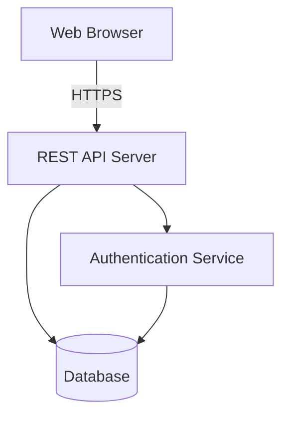

# Design Document - Family Budget Tracker

## Overview

The Family Budget Tracker is a web-based application that enables married couples to collaboratively manage household finances. The system provides expense tracking, budget management, credit card monitoring, installment tracking, savings goals, and income comparison features. The application uses a client-server architecture with a responsive web interface.

## Architecture

### System Architecture



### Technology Stack

- **Frontend**: React with TypeScript
- **Backend**: Python with Flask
- **Database**: PostgreSQL
- **ORM**: SQLAlchemy
- **Authentication**: JWT (JSON Web Tokens) with Flask-JWT-Extended
- **State Management**: React Context API
- **Styling**: Tailwind CSS
- **Charts**: Chart.js or Recharts
- **API Documentation**: Flask-RESTX (Swagger)

## Components and Interfaces

### Frontend Components

#### 1. Authentication Module
- **LoginPage**: User login form
- **RegisterPage**: New user registration form
- **AuthContext**: Manages authentication state across the app

#### 2. Dashboard Module
- **Dashboard**: Main overview showing:
  - Monthly income vs expenses chart
  - Budget status summary
  - Quick stats (total spent, remaining budget, net income)
  - Recent expenses list
  - Upcoming installment payments
  - Budget warnings/alerts

#### 3. Expense Management Module
- **ExpenseList**: Displays all expenses with filtering options
- **ExpenseForm**: Add/edit expense form
- **ExpenseItem**: Individual expense display with edit/delete actions
- **CategoryFilter**: Filter expenses by category, date range, or spouse

#### 4. Budget Management Module
- **BudgetOverview**: Shows all budget categories with limits and spending
- **BudgetForm**: Set/edit budget limits for categories
- **CategoryManager**: Add/edit custom categories

#### 5. Credit Card Module
- **CreditCardList**: Displays all credit cards with balances
- **CreditCardForm**: Add/edit credit card details
- **CreditCardTransaction**: Record payments or charges

#### 6. Installment Module
- **InstallmentList**: Shows all installments with payment status
- **InstallmentForm**: Create new installment plan
- **InstallmentDetail**: View installment details and payment history

#### 7. Savings Module
- **SavingsGoalList**: Displays all savings goals with progress
- **SavingsGoalForm**: Create/edit savings goal
- **SavingsContribution**: Record savings contribution

#### 8. Account Management Module
- **AccountSettings**: User profile and settings
- **InviteSpouse**: Send invitation to spouse
- **SharedAccountView**: View shared account details

### Backend API Endpoints

#### Authentication
- `POST /api/auth/register` - Register new user
- `POST /api/auth/login` - User login
- `POST /api/auth/logout` - User logout
- `GET /api/auth/me` - Get current user

#### Account Management
- `POST /api/account/invite` - Invite spouse to shared account
- `POST /api/account/accept-invite` - Accept invitation
- `GET /api/account/shared` - Get shared account details

#### Expenses
- `GET /api/expenses` - Get all expenses (with filters)
- `POST /api/expenses` - Create new expense
- `PUT /api/expenses/:id` - Update expense
- `DELETE /api/expenses/:id` - Delete expense
- `GET /api/expenses/summary` - Get spending summary by category

#### Categories
- `GET /api/categories` - Get all categories
- `POST /api/categories` - Create custom category
- `PUT /api/categories/:id` - Update category
- `DELETE /api/categories/:id` - Delete category

#### Budgets
- `GET /api/budgets` - Get all budget limits
- `POST /api/budgets` - Create budget limit
- `PUT /api/budgets/:id` - Update budget limit
- `DELETE /api/budgets/:id` - Delete budget limit
- `GET /api/budgets/status` - Get budget status with warnings

#### Credit Cards
- `GET /api/credit-cards` - Get all credit cards
- `POST /api/credit-cards` - Add credit card
- `PUT /api/credit-cards/:id` - Update credit card
- `DELETE /api/credit-cards/:id` - Delete credit card
- `POST /api/credit-cards/:id/transactions` - Record payment/charge

#### Installments
- `GET /api/installments` - Get all installments
- `POST /api/installments` - Create installment
- `PUT /api/installments/:id` - Update installment
- `DELETE /api/installments/:id` - Delete installment
- `POST /api/installments/:id/pay` - Mark payment as completed

#### Savings Goals
- `GET /api/savings-goals` - Get all savings goals
- `POST /api/savings-goals` - Create savings goal
- `PUT /api/savings-goals/:id` - Update savings goal
- `DELETE /api/savings-goals/:id` - Delete savings goal
- `POST /api/savings-goals/:id/contributions` - Add contribution

#### Income
- `GET /api/income` - Get monthly income records
- `POST /api/income` - Set monthly income
- `PUT /api/income/:id` - Update monthly income

## Data Models

### User
```typescript
interface User {
  id: string;
  email: string;
  password: string; // hashed
  name: string;
  sharedAccountId: string | null;
  createdAt: Date;
  updatedAt: Date;
}
```

### SharedAccount
```typescript
interface SharedAccount {
  id: string;
  createdAt: Date;
  updatedAt: Date;
}
```

### Invitation
```typescript
interface Invitation {
  id: string;
  inviterId: string;
  inviteeEmail: string;
  sharedAccountId: string;
  status: 'pending' | 'accepted' | 'rejected';
  createdAt: Date;
  expiresAt: Date;
}
```

### Expense
```typescript
interface Expense {
  id: string;
  sharedAccountId: string;
  userId: string;
  amount: number;
  categoryId: string;
  date: Date;
  description: string;
  createdAt: Date;
  updatedAt: Date;
}
```

### Category
```typescript
interface Category {
  id: string;
  sharedAccountId: string;
  name: string;
  isCustom: boolean;
  createdAt: Date;
}
```

### BudgetLimit
```typescript
interface BudgetLimit {
  id: string;
  sharedAccountId: string;
  categoryId: string;
  amount: number;
  period: 'weekly' | 'monthly';
  createdAt: Date;
  updatedAt: Date;
}
```

### CreditCard
```typescript
interface CreditCard {
  id: string;
  sharedAccountId: string;
  name: string;
  creditLimit: number;
  currentBalance: number;
  createdAt: Date;
  updatedAt: Date;
}
```

### CreditCardTransaction
```typescript
interface CreditCardTransaction {
  id: string;
  creditCardId: string;
  userId: string;
  amount: number;
  type: 'payment' | 'charge';
  date: Date;
  description: string;
  createdAt: Date;
}
```

### Installment
```typescript
interface Installment {
  id: string;
  sharedAccountId: string;
  userId: string;
  totalAmount: number;
  numberOfPayments: number;
  monthlyPayment: number;
  startDate: Date;
  description: string;
  paidPayments: number;
  createdAt: Date;
  updatedAt: Date;
}
```

### SavingsGoal
```typescript
interface SavingsGoal {
  id: string;
  sharedAccountId: string;
  name: string;
  targetAmount: number;
  currentBalance: number;
  targetDate: Date | null;
  createdAt: Date;
  updatedAt: Date;
}
```

### SavingsContribution
```typescript
interface SavingsContribution {
  id: string;
  savingsGoalId: string;
  userId: string;
  amount: number;
  date: Date;
  createdAt: Date;
}
```

### MonthlyIncome
```typescript
interface MonthlyIncome {
  id: string;
  sharedAccountId: string;
  month: number; // 1-12
  year: number;
  amount: number;
  createdAt: Date;
  updatedAt: Date;
}
```

## Database Schema

### SQLAlchemy Models

The database will be managed using SQLAlchemy ORM with Flask-Migrate for migrations. Below is the SQL schema representation:

```sql
-- Users table
CREATE TABLE users (
  id UUID PRIMARY KEY DEFAULT gen_random_uuid(),
  email VARCHAR(255) UNIQUE NOT NULL,
  password VARCHAR(255) NOT NULL,
  name VARCHAR(255) NOT NULL,
  shared_account_id UUID,
  created_at TIMESTAMP DEFAULT NOW(),
  updated_at TIMESTAMP DEFAULT NOW()
);

-- Shared accounts table
CREATE TABLE shared_accounts (
  id UUID PRIMARY KEY DEFAULT gen_random_uuid(),
  created_at TIMESTAMP DEFAULT NOW(),
  updated_at TIMESTAMP DEFAULT NOW()
);

-- Invitations table
CREATE TABLE invitations (
  id UUID PRIMARY KEY DEFAULT gen_random_uuid(),
  inviter_id UUID NOT NULL REFERENCES users(id),
  invitee_email VARCHAR(255) NOT NULL,
  shared_account_id UUID NOT NULL REFERENCES shared_accounts(id),
  status VARCHAR(20) NOT NULL DEFAULT 'pending',
  created_at TIMESTAMP DEFAULT NOW(),
  expires_at TIMESTAMP NOT NULL
);

-- Categories table
CREATE TABLE categories (
  id UUID PRIMARY KEY DEFAULT gen_random_uuid(),
  shared_account_id UUID NOT NULL REFERENCES shared_accounts(id),
  name VARCHAR(100) NOT NULL,
  is_custom BOOLEAN DEFAULT false,
  created_at TIMESTAMP DEFAULT NOW()
);

-- Expenses table
CREATE TABLE expenses (
  id UUID PRIMARY KEY DEFAULT gen_random_uuid(),
  shared_account_id UUID NOT NULL REFERENCES shared_accounts(id),
  user_id UUID NOT NULL REFERENCES users(id),
  amount DECIMAL(10, 2) NOT NULL,
  category_id UUID NOT NULL REFERENCES categories(id),
  date DATE NOT NULL,
  description TEXT,
  created_at TIMESTAMP DEFAULT NOW(),
  updated_at TIMESTAMP DEFAULT NOW()
);

-- Budget limits table
CREATE TABLE budget_limits (
  id UUID PRIMARY KEY DEFAULT gen_random_uuid(),
  shared_account_id UUID NOT NULL REFERENCES shared_accounts(id),
  category_id UUID NOT NULL REFERENCES categories(id),
  amount DECIMAL(10, 2) NOT NULL,
  period VARCHAR(20) NOT NULL,
  created_at TIMESTAMP DEFAULT NOW(),
  updated_at TIMESTAMP DEFAULT NOW()
);

-- Credit cards table
CREATE TABLE credit_cards (
  id UUID PRIMARY KEY DEFAULT gen_random_uuid(),
  shared_account_id UUID NOT NULL REFERENCES shared_accounts(id),
  name VARCHAR(100) NOT NULL,
  credit_limit DECIMAL(10, 2) NOT NULL,
  current_balance DECIMAL(10, 2) NOT NULL,
  created_at TIMESTAMP DEFAULT NOW(),
  updated_at TIMESTAMP DEFAULT NOW()
);

-- Credit card transactions table
CREATE TABLE credit_card_transactions (
  id UUID PRIMARY KEY DEFAULT gen_random_uuid(),
  credit_card_id UUID NOT NULL REFERENCES credit_cards(id),
  user_id UUID NOT NULL REFERENCES users(id),
  amount DECIMAL(10, 2) NOT NULL,
  type VARCHAR(20) NOT NULL,
  date DATE NOT NULL,
  description TEXT,
  created_at TIMESTAMP DEFAULT NOW()
);

-- Installments table
CREATE TABLE installments (
  id UUID PRIMARY KEY DEFAULT gen_random_uuid(),
  shared_account_id UUID NOT NULL REFERENCES shared_accounts(id),
  user_id UUID NOT NULL REFERENCES users(id),
  total_amount DECIMAL(10, 2) NOT NULL,
  number_of_payments INTEGER NOT NULL,
  monthly_payment DECIMAL(10, 2) NOT NULL,
  start_date DATE NOT NULL,
  description TEXT,
  paid_payments INTEGER DEFAULT 0,
  created_at TIMESTAMP DEFAULT NOW(),
  updated_at TIMESTAMP DEFAULT NOW()
);

-- Savings goals table
CREATE TABLE savings_goals (
  id UUID PRIMARY KEY DEFAULT gen_random_uuid(),
  shared_account_id UUID NOT NULL REFERENCES shared_accounts(id),
  name VARCHAR(255) NOT NULL,
  target_amount DECIMAL(10, 2) NOT NULL,
  current_balance DECIMAL(10, 2) DEFAULT 0,
  target_date DATE,
  created_at TIMESTAMP DEFAULT NOW(),
  updated_at TIMESTAMP DEFAULT NOW()
);

-- Savings contributions table
CREATE TABLE savings_contributions (
  id UUID PRIMARY KEY DEFAULT gen_random_uuid(),
  savings_goal_id UUID NOT NULL REFERENCES savings_goals(id),
  user_id UUID NOT NULL REFERENCES users(id),
  amount DECIMAL(10, 2) NOT NULL,
  date DATE NOT NULL,
  created_at TIMESTAMP DEFAULT NOW()
);

-- Monthly income table
CREATE TABLE monthly_income (
  id UUID PRIMARY KEY DEFAULT gen_random_uuid(),
  shared_account_id UUID NOT NULL REFERENCES shared_accounts(id),
  month INTEGER NOT NULL,
  year INTEGER NOT NULL,
  amount DECIMAL(10, 2) NOT NULL,
  created_at TIMESTAMP DEFAULT NOW(),
  updated_at TIMESTAMP DEFAULT NOW(),
  UNIQUE(shared_account_id, month, year)
);
```

### Python Dependencies

```
Flask==3.0.0
Flask-SQLAlchemy==3.1.1
Flask-Migrate==4.0.5
Flask-JWT-Extended==4.5.3
Flask-CORS==4.0.0
Flask-RESTX==1.2.0
psycopg2-binary==2.9.9
python-dotenv==1.0.0
bcrypt==4.1.1
```

## Error Handling

### Client-Side Error Handling
- Display user-friendly error messages using toast notifications
- Validate form inputs before submission
- Handle network errors with retry options
- Show loading states during API calls

### Server-Side Error Handling
- Return consistent error response format:
```typescript
interface ErrorResponse {
  error: string;
  message: string;
  statusCode: number;
}
```

### Common Error Scenarios
- **401 Unauthorized**: Invalid or expired token - redirect to login
- **403 Forbidden**: User doesn't have access to shared account
- **404 Not Found**: Resource doesn't exist
- **409 Conflict**: Duplicate email during registration
- **422 Validation Error**: Invalid input data
- **500 Server Error**: Internal server error - show generic error message

## Testing Strategy

### Unit Tests
- Test individual functions and utilities
- Test data validation logic
- Test calculation functions (budget status, installment payments, etc.)
- Test React components in isolation

### Integration Tests
- Test API endpoints with database
- Test authentication flow
- Test expense CRUD operations
- Test budget calculations with real data
- Test shared account functionality

### End-to-End Tests
- Test complete user workflows:
  - User registration and login
  - Creating and managing expenses
  - Setting budget limits and viewing warnings
  - Inviting spouse and sharing account
  - Recording installments and tracking payments
  - Managing savings goals
  - Viewing dashboard with income comparison

### Security Testing
- Test authentication and authorization
- Test SQL injection prevention
- Test XSS prevention
- Test CSRF protection
- Test password hashing

## Security Considerations

### Authentication
- Use bcrypt for password hashing (built into Flask-Bcrypt)
- Implement JWT with expiration (24 hours) using Flask-JWT-Extended
- Store tokens in httpOnly cookies
- Implement refresh token mechanism

### Authorization
- Verify user belongs to shared account before accessing data
- Implement middleware to check shared account access
- Validate user permissions for all operations

### Data Protection
- Use HTTPS for all communications
- Sanitize all user inputs
- Use parameterized queries to prevent SQL injection
- Implement rate limiting on API endpoints
- Validate and sanitize file uploads (if any)

### Privacy
- Users can only access their own shared account data
- Implement proper data isolation between shared accounts
- Log sensitive operations for audit trail

## Performance Considerations

### Database Optimization
- Index frequently queried columns (user_id, shared_account_id, date)
- Use database connection pooling
- Implement pagination for large result sets
- Cache frequently accessed data (categories, budget limits)

### Frontend Optimization
- Implement lazy loading for routes
- Use React.memo for expensive components
- Debounce search and filter inputs
- Optimize chart rendering with data sampling for large datasets

### API Optimization
- Implement response caching where appropriate
- Use compression for API responses
- Batch related queries to reduce database round trips
- Implement request throttling

## Deployment Strategy

### Development Environment
- Local PostgreSQL database
- Python Flask development server with debug mode
- React development server with Vite

### Production Environment
- Deploy backend to cloud platform (e.g., Heroku, AWS, DigitalOcean)
- Deploy frontend to CDN (e.g., Vercel, Netlify)
- Use managed PostgreSQL database
- Implement CI/CD pipeline for automated deployments
- Set up monitoring and logging (e.g., Sentry, LogRocket)

## Future Enhancements

- Mobile app (React Native)
- Export data to CSV/PDF
- Recurring expenses automation
- Bill reminders and notifications
- Multi-currency support
- Bank account integration
- Receipt photo uploads
- Budget recommendations based on spending patterns
